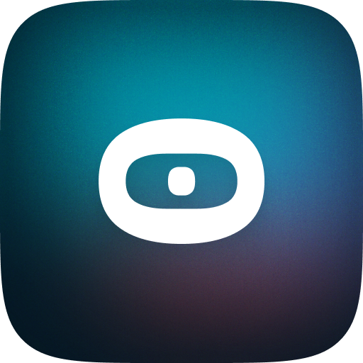

<div align="center">

</div>

# zeroID

zeroID is a project focused on providing users with a single digital identity or QR code that can be used to verify their identity anywhere in the world. The goal is to solve real-life issues around sharing government-issued IDs across different platforms, which poses privacy and security risks of identity theft.

The zero-knowledge proof IDs from ZeroID remove this concern, as the IDs themselves do not contain any personal information without additional user input. They function as secure, universal proofs of identity.

The system is designed for ease-of-use, with no sign ups, fees, or human interaction required for ID generation. Even children can create their own zeroID.

The initial launch focuses on India due to recent incidents of compromised government ID databases. However, the plan is to scale ZeroID globally with support from Mina Protocol.

Beyond identity verification, the ZeroID API enables broader applications to be built on top of the platform, reducing manual verification and potential errors.


## Table of Contents

- [About](#about)
- [Getting Started](#getting_started)
- [Usage](#usage)

## About <a name = "about"></a>

ZeroID provide a novel zero-knowledge approach to digital identity that prioritizes both security and accessibility. The goal is a foundation for both reliable identity verification as well as future innovation.

It provides users with a single digital identity in the form of a QR code that can be used to verify their identity anywhere in the world. It offers a novel approach to digital IDs using zero-knowledge proof cryptography, removing concerns around privacy and security compared to sharing physical government-issued IDs. Users don't need to worry about their digital ZeroID being stolen or misused.

The system is designed for maximum accessibility, with no sign ups, fees or human interaction required to generate an ID. The goal is ease-of-use for people of all ages and backgrounds.

Initially focused on India to address incidents of compromised government databases, ZeroID aims to scale globally with support from Mina Protocol. The long-term vision is an open identity verification platform that reduces manual checks and drives innovation.

ZeroID removes friction from proving and verifying identity, opening up new possibilities in finance, governance, web3 and more. It represents an important evolution in digital identity.


## Getting Started <a name = "getting_started"></a>

To get a local copy of the project up and running, follow these steps.

### Prerequisites

You need to have Node.js and npm installed on your machine.

### Installation

1. Clone the repo

```sh
git clone https://github.com/boidushya/ZeroID.git
```
2. CD into the folders

```sh
cd /ZeroID/MID/
```

3. Install Packages

```sh
npm install
```

## Usage <a name = "usage"></a>

Run it Locally

```sh
turbo dev
```

Video Demo : [Click Here](https://youtu.be/3O2vWERGsS0)

## License
This project is licensed under the [MIT] License - see the [LICENSE.md](LICENSE.md) file for details.
